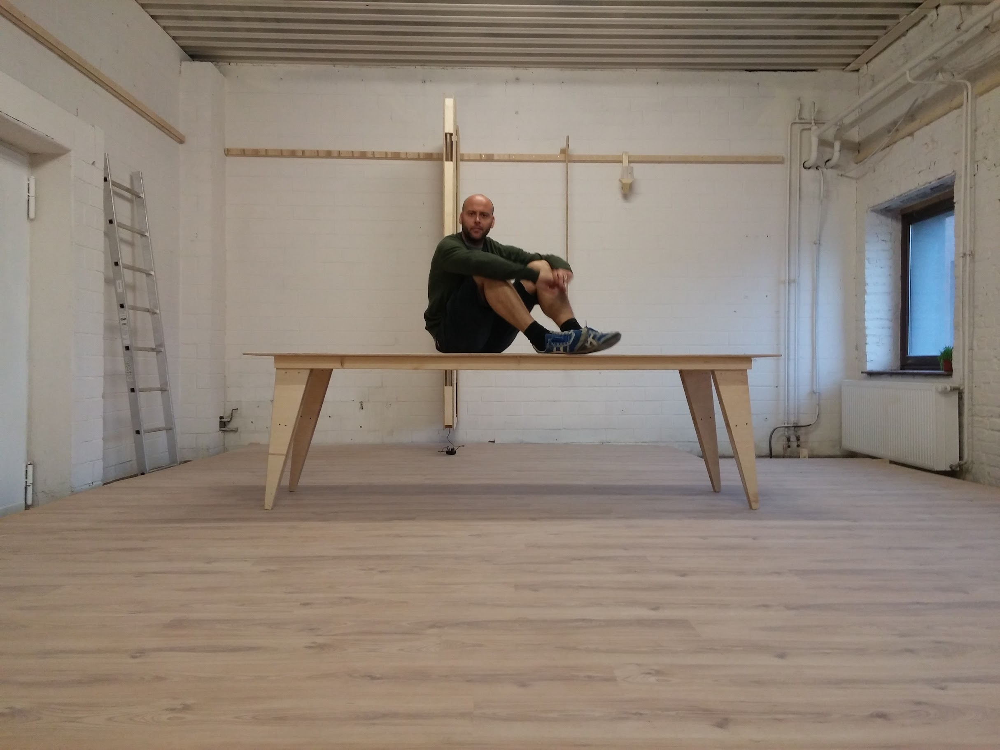
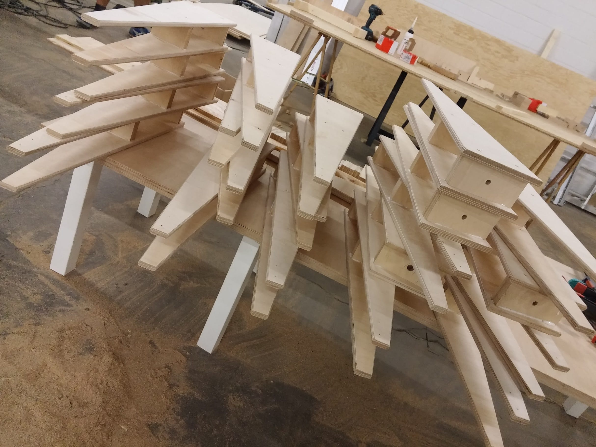
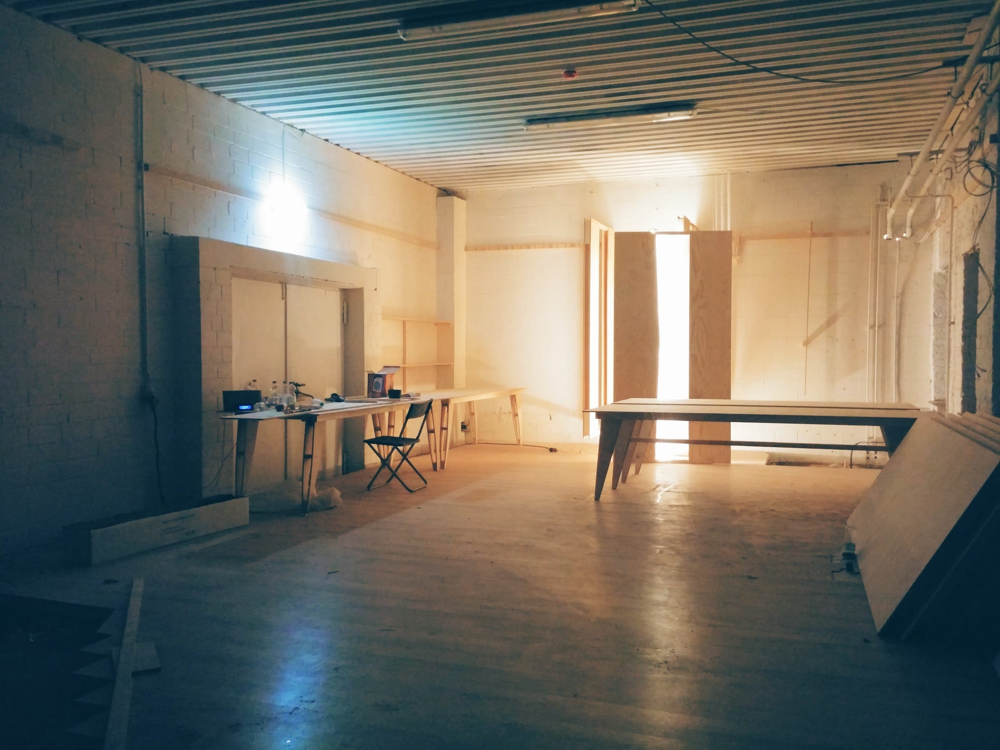
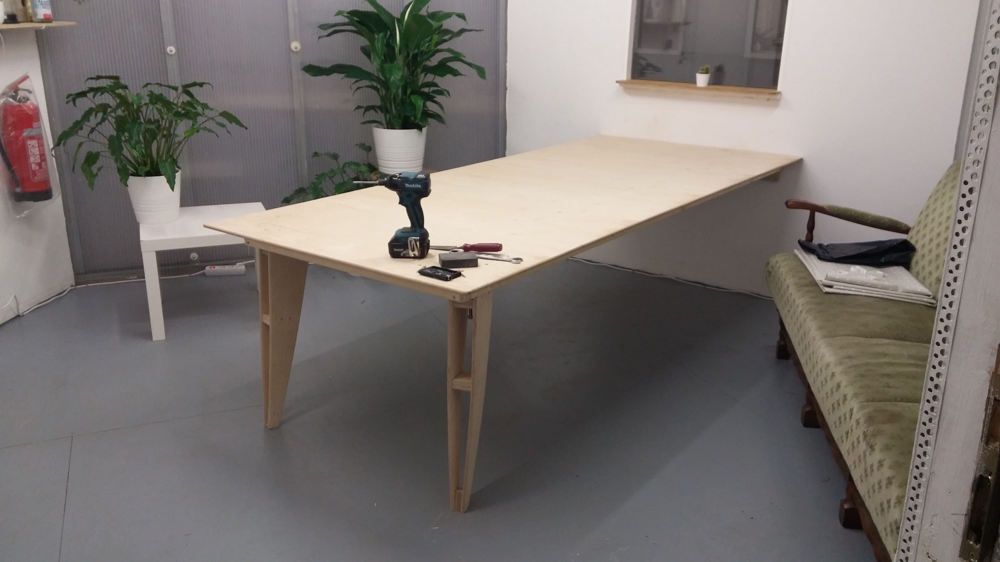
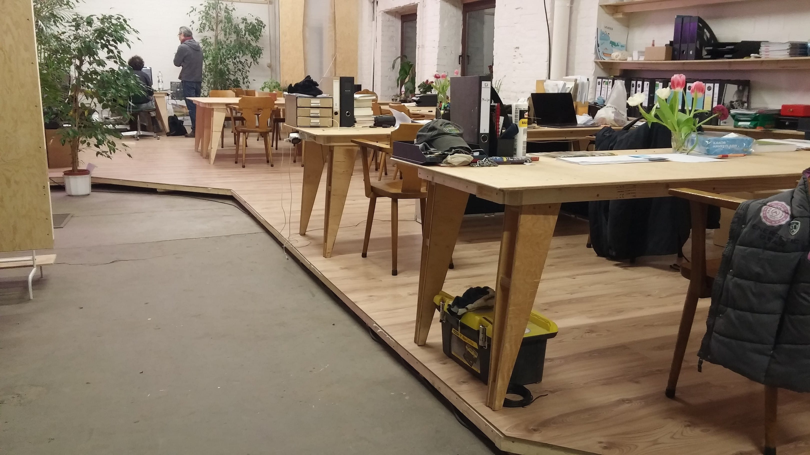

# OpenDeskAriane

Parametric CAD model. Furniture can be disassembled for storage without tools. Legs are fastened by hand. Turning them clockwise will tighten the integrated machine screws. When not in use, furniture can be stored at a wall without the use of dedicated hooks due to the integrated french cleats.

Part of the [OpenEventSpace](https://github.com/etemu/OpenEventSpace)

Making of (click for video):

